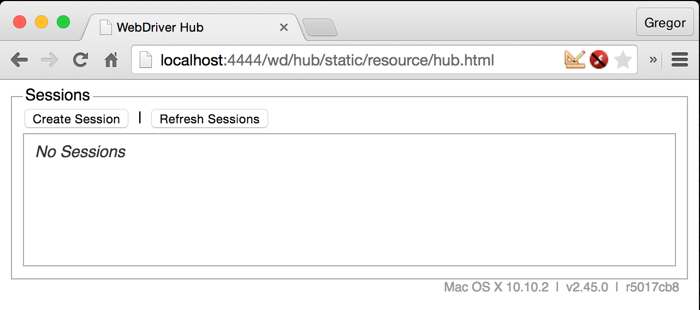

# Test Set-Up mit Protractor

## Was ist Protractor
`protractor` ist eine NodeJS-Bibliothek zur Erstellung von Oberflächentests von AngularJS Anwendungen.

## Benötigt

- node v0.10.0 oder höher (`node --version`)
- npm

## Installation

`npm install -g protractor`

Installation verifizieren
`protractor --version`

Bei der Installation von protractor wird ebenso der `webdriver-manager` und die `Protractor API` installiert.

## Erster Start

`webdriver-manager update`
Aktualisiert Selenium Standalone Server und Chrome-Driver

`webdriver-manager start`
Protractor sendet requests an `http://localhost:4444/wd/hub` um den Browser zu steuern.

## Konfiguration

`conf.js`

## Test ausführren

`protractor conf.js`

## Quellen
- [http://angular.github.io/protractor](http://angular.github.io/protractor/#/toc)
